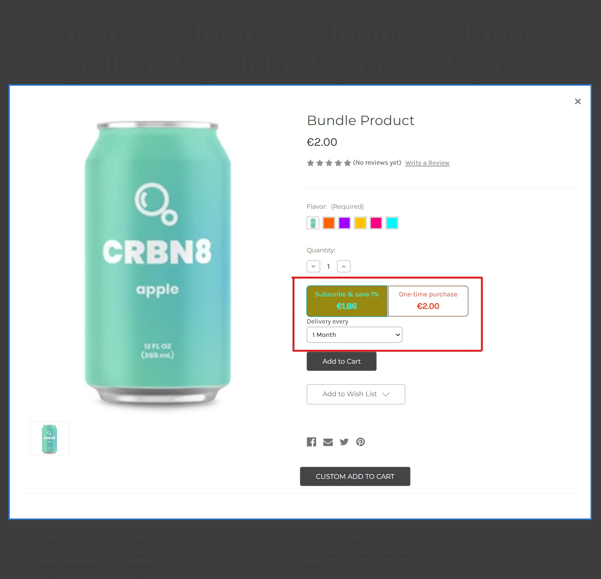
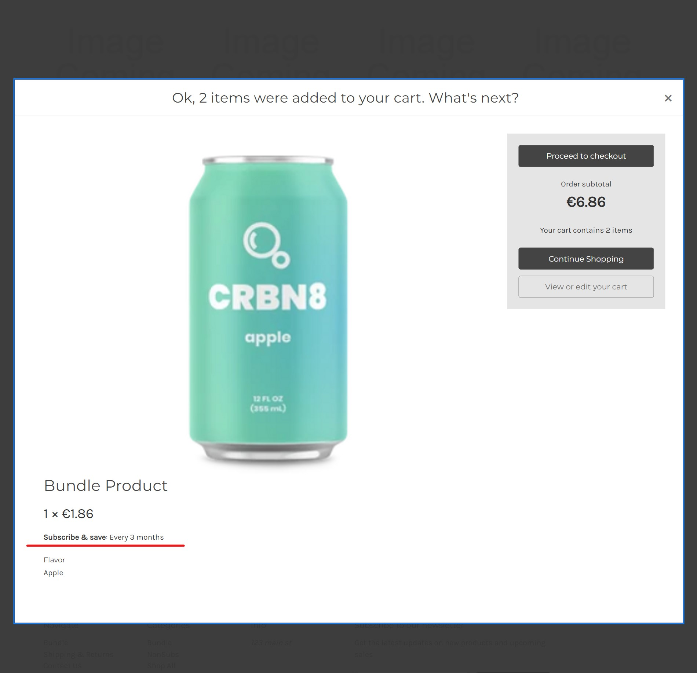
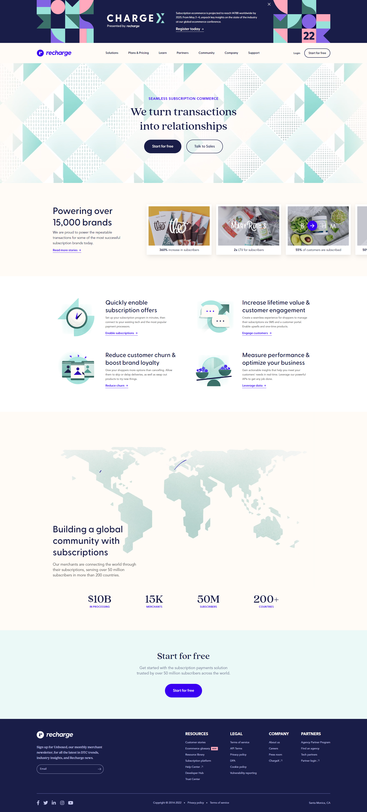
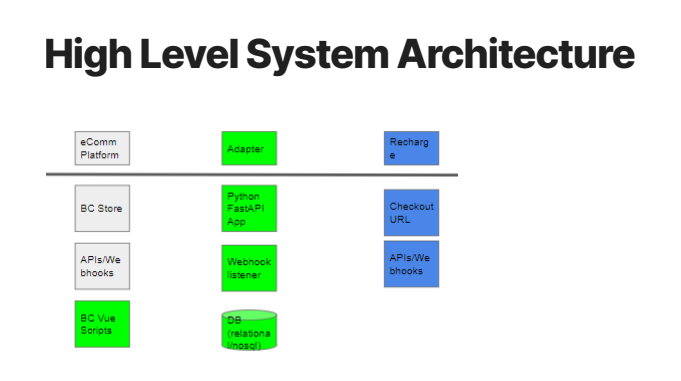

### Description
Cameo is working for a client named Recharge Payments to create the Recharge Adapter. Recharge is currently the #1 subscriptions app on the Shopify App Store. The Recharge Adapter is a web-side plugin that extends Recharge’s functionality beyond Shopify to BigCommerce (currently) and Magento, WooCommerce, or any other eCommerce platform via API backend development and Javascript Vue front end development.  The Recharge Adapter injects code into the stores and takes over some of the processes of these stores.

### Tech
Poetry, FastAPI, Vue.js, Flake8, Google Cloud Run, Github Actions, CodeStream, Docker, Bigcommerce, Shopify, Woocommerce, Payment gateway, Unit tests, Selenum tests, WebDriver

### High-level architecture
[BC CP Specs · High Level System Architecture](BC%20CP%20Specs%20·%20High%20Level%20System%20Architecture.pdf)

### Demo
Check out a demo video [HERE](https://www.loom.com/share/9996064ddff84c9d8084e03eb3465a99).

### Mockup

|  |  |
|--------------------------------|--------------------------------|
|  |  |
